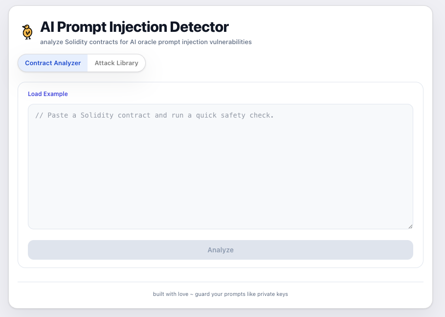

# AI Prompt Injection Detector

Security analysis tool for detecting prompt injection vulnerabilities in smart contracts with AI oracle integrations.



## What It Does

Tests your smart contracts against prompt injection attack vectors. Automatically detects AI oracle integrations, identifies missing security controls, and generates detailed security reports with risk scores.

**Features:**
- Automatically detects AI oracle integrations in Solidity code
- Identifies missing security controls (input validation, response verification, rate limiting)
- Calculates risk scores based on vulnerability severity (0-100 scale)
- Comprehensive reference of 5 major injection techniques
- Real-world attack payloads with explanations
- Visual security dashboard with vulnerability categorization
- Works with any Solidity contract (no build tools required)

## Installation

**Requirements:** Modern web browser (Chrome, Firefox, Safari, Edge)

**Option 1: Open Directly**
1. Download `index.html`
2. Open in any modern browser
3. Start analyzing contracts immediately

No build tools, dependencies, or setup required!

**Option 2: Local Server**
```bash
# Using Python
python -m http.server 8000

# Using Node.js
npx serve .

# Visit http://localhost:8000
```

## Usage

**Quick Start:**

1. **Navigate to Contract Analyzer tab**
2. **Paste your Solidity code** or click "Load Example Contract"
3. **Click "Analyze Contract"**
4. **Review results:**
   - Risk score
   - Detected AI oracle integrations
   - Specific vulnerabilities
   - Security checklist

**Manual Analysis:**

1. **Switch to Attack Library tab**
2. **Browse attack techniques** organized by severity
3. **Review each attack:**
   - Attack payload
   - How it works
   - Potential impact
   - Mitigation strategy

## Attack Categories

1. **Direct Override**: Complete system prompt override (Ignore Previous Instructions)
2. **Role Playing**: AI permission/authority manipulation (Role Switching)
3. **Delimiter Confusion**: Input boundary breakout (Delimiter Escape)
4. **Context Poisoning**: False context injection for decision manipulation
5. **JSON Structure Manipulation**: Malicious response format injection

## Examples

See the Contract Analyzer tab for a complete example:

```solidity
// VULNERABLE: Multiple security issues
contract VulnerableAITrader {
    IAIOracle public aiOracle;
    
    // No input validation
    // No response verification
    function executeTradeIntent(string memory userIntent) public {
        // Directly concatenates user input
        string memory prompt = "Execute: " + userIntent;
        
        // Calls AI oracle without protection
        string memory response = aiOracle.query(prompt);
        
        // Executes based on unverified response
        _executeTrade(response);
    }
}
```

**Detected Issues:**
- Missing Input Validation (Critical)
- No Response Verification (High)

**Risk Score: 65/100**

## Reports

The tool generates visual security reports in the dashboard including:
- Risk score (0-100 scale)
- Breakdown by severity (critical, high)
- Breakdown by attack category
- Security checklist validation
- Detailed vulnerability descriptions

## Troubleshooting

1. **Analysis not detecting vulnerabilities?** Make sure your contract includes AI oracle function calls (`aiOracle.query()`, `llm.generate()`, etc.).

2. **False positives?** Review the security checklist and verify that your contract implements the recommended controls.

3. **Page not loading?** Make sure you're using a modern browser and that `index.html` is accessible.

## Contributing

Contributions welcome! To add new attack vectors:
1. Add to the attack vector library in `index.html`
2. Choose appropriate severity classification
3. Include mitigation strategies
4. Test against example contracts

## License

MIT License

## Disclaimer

This tool is for security testing of smart contracts you own or have explicit permission to test. Always get authorization before testing contracts you don't own. Use responsibly and ethically.

## Resources

- [OWASP LLM Top 10](https://owasp.org/www-project-top-10-for-large-language-model-applications/)
- [Prompt Injection Primer](https://simonwillison.net/2023/Apr/14/worst-that-can-happen/)
- [LLM Security Best Practices](https://www.anthropic.com/index/claude-2-1-prompting)
